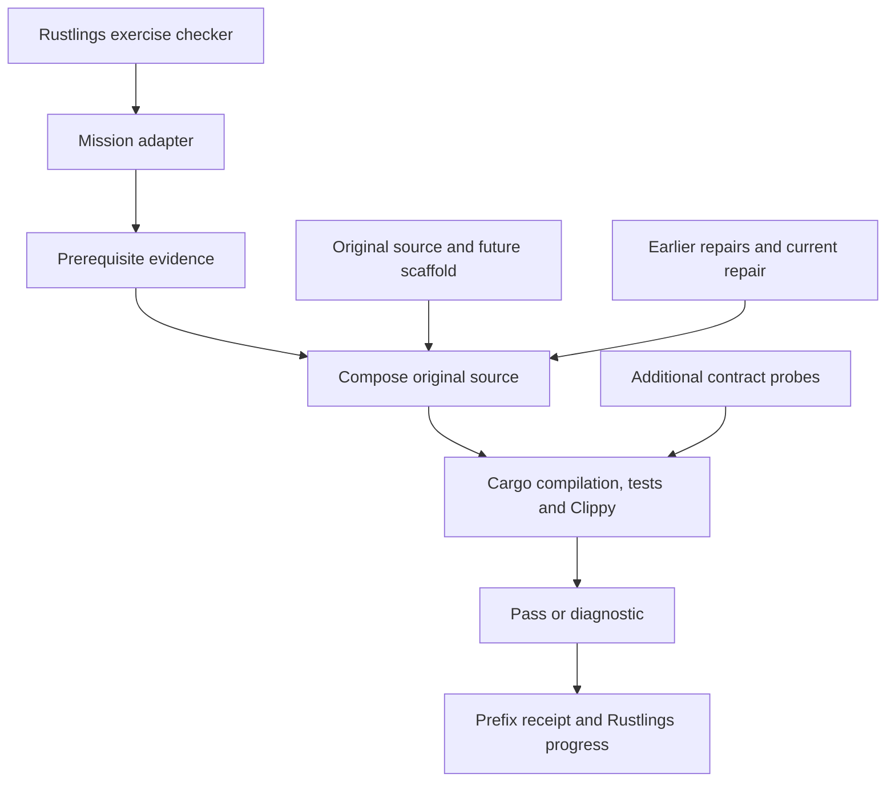

# Architecture description record

**Record:** AD-001, Rebuild the Checker. **Revision:** 3. **Status:** implemented course design. **Date:** 2026-09-24. **Owner:** fork maintainers. **Baseline:** original engine `a650509c789da1656f813392b16aa1fa043b7f3e`, course audit starting at `1b871b5706c358ab9d31337f2e3dec3a493dbc0d`. **Audience:** learners, course authors, maintainers, and reviewers.

This record uses the architecture-description concepts of [ISO/IEC/IEEE 42010:2022](https://www.iso.org/standard/74393.html): an entity of interest, stakeholders and concerns, viewpoints, views, model kinds, correspondences, and decision rationale. It is an ISO-aligned project record, not a claim of independently audited conformance to every clause of the paid standard.

## Entity, environment, and boundaries

The entity of interest is a Rustlings-hosted source-restoration curriculum. Its assessed product is the pinned Rustlings automatic checking infrastructure. Its environment is a local Rust toolchain, an ordinary filesystem, a terminal, and Cargo's dependency cache. Filesystem watching and editor integration retain the pinned implementation's OS behavior.

The existing host engine owns exercise order, UI, hints, build/test/lint/run gates, reset, solution reveal, and its progress file. Course-owned input fixtures provide a source archive, source-range registry, adapter, verifier, and extra regression probes. All generated code and evidence live under `target/workshop`. The separately exported final product contains the original project files with learner repairs.

## Stakeholders, perspectives, and concerns

| Stakeholder | Perspective | Concern IDs | Required outcome |
| --- | --- | --- | --- |
| Learner | Understand, implement, diagnose | C1 progression; C2 actionable feedback; C3 manageable tasks | Named missions, local contracts, hints, cumulative evidence, and clear source mapping. |
| Course author | Reuse the architecture for another subject | C4 author validation; C5 domain transfer | Independent failing-starter tests, passing solutions, and authoring-tool practice. |
| Maintainer | Preserve compatibility and fidelity | C6 engine preservation; C7 reproducibility; C8 cost | Preserved engine algorithms, additive course hooks, pinned dependencies, inspectable mapping, incremental build caching. |
| Reviewer | Audit the resulting product | C9 traceability; C10 honest evidence | Source ranges, exact reference reconstruction, test reports, and explicit untested boundaries. |
| Upstream Rustlings contributors | Preserve provenance | C11 attribution and scope | Original license and implementation retained; no invented replacement runner. |

## Viewpoints and model kinds

| Viewpoint | Concerns framed | Model kind and interpretation | Evaluation method |
| --- | --- | --- | --- |
| VP1 curriculum | C1–C5 | Ordered mission table: an edge means an earlier repair is a prerequisite. | Sequential progression and locked-prerequisite tests. |
| VP2 source composition | C6, C7, C9, C11 | File/range mapping: each mission owns one disjoint byte interval at the pinned revision. | Bounds, overlap, complete archive, and byte-equality checks. |
| VP3 execution | C2, C4, C6, C8 | Process/dataflow view: a gate must return success before the next completion transition. | Original checks, added probes, and independent injected-defect audit. |
| VP4 state and recovery | C1, C7, C8, C10 | State transition table: certification is tied to a cumulative source prefix and verifier/toolchain identity. | Prior-edit invalidation, cache-input equality, interrupted-check recovery. |
| VP5 deployment and final artifact | C6, C7, C9–C11 | Artifact inventory: distinguish shipped course data, disposable checks, and the final original project. | Fresh initialization, export inventory, reference hashes, and standalone checks. |

## VP1 curriculum view

The campaign map and chapter mission tables instantiate VP1. The order moves from metadata to process execution, distribution, progress, terminal output, navigation, watch orchestration, editors, author tools, and final dispatch. Each chapter includes an architecture checkpoint and an unscored transfer problem. Source repair and troubleshooting alternate throughout the campaign; TODO missions require code writing and BUG missions require changing existing behavior.

## VP2 source composition view

| Artifact | Responsibility | Mutability |
| --- | --- | --- |
| `01_catalog/upstream.txt` | Length-prefixed UTF-8 snapshot of the pinned build-relevant original project, including its course data and license | Author fixture |
| `01_catalog/missions.tsv` | Ordered source-range map consumed without external runtime dependencies | Author fixture |
| `01_catalog/missions.json` | Human-inspectable contracts, source ranges, starter defects, and reference repairs | Author fixture |
| Chapter mission `.rs` files | Learner-owned repair plus unchanged adapter/test | Learner repair region |
| Matching solution `.rs` files | Exact original source for the same repair interval | Reference, revealed by Rustlings |
| `01_catalog/probes.txt` | Additive behavior tests inserted only into check builds | Author fixture |
| `01_catalog/runner.rs`, `grader.rs` | Course-only bridge from normal Rustlings exercise execution to source reconstruction | Author fixture |
| `target/workshop/engine` | Last assembled checking workspace, including probes | Disposable |
| Final export | Pinned original file inventory with cumulative repairs and no probes | Learner product |

The snapshot is the existing Rustlings project, not a newly designed target. It excludes unrelated website/workflow material from the final build artifact. Its `dev-Cargo.toml` symlink is materialized as the exact referenced manifest contents so the portable text archive works on Windows as well as Unix.

## VP3 execution view

The host's success contract remains build → optional tests → Clippy → execution. The course's execution performs another real Rustlings build and regression suite. There is one serialized compiler workspace per initialized course; cached reports avoid repeating equivalent checks. Cache hits require equality of the complete serialized source input, not just equality of a hash. Before uncached behavioral checks, each compiled crate must attest the current input key; Cargo tracks the key through an environment dependency so timestamp reuse cannot silently select an older implementation. Verifier, probe, registry, snapshot, toolchain, platform, build environment, and Cargo configuration changes invalidate evidence. A 600-second course host command encloses the verifier's single 540-second budget for queueing, Clippy, debug tests, and the focused release test. Timeout cleanup owns descendant processes. The original policy is preserved in ordinary courses and the exported target.

The test snapshot preserves original production source except for learner replacements. Additional test modules are appended under `cfg(test)` and never appear in the export. Disposable check builds also add standalone workspace declarations to the two excluded exercise manifests, preventing an enclosing course workspace from capturing them. These boundary declarations are not exported. The original engine dependencies and Cargo.lock remain the compiler environment.

## VP4 state and recovery view

| State/event | Transition | Evidence |
| --- | --- | --- |
| First launch | Pending; prepare dependencies | Baseline compilation and tests; no learner receipt |
| Current repair fails | Remains pending | Compiler/Clippy/test diagnostics |
| Current repair passes | Record the entire certified prefix | Source-specific receipt plus host completion |
| Earlier repair changes | Later prefix evidence no longer matches | Recheck from the earliest changed mission |
| Solution is checked | Validate canonical prefix independently | Does not read or overwrite learner progress |
| Process interruption | Retain learner files; OS releases the compiler lock | Retry using the disposable check state |
| Final export | Require all learner receipts and revalidate composition | Actual learner source written to a new destination |

The persisted host done flags are a UI convenience. The verifier's prefix receipts bind earlier work to the implementation currently being checked. Neither mechanism is intended as adversarial exam security.

## VP5 deployment and final artifact view

Normal `rustlings init` embeds and materializes the renamed missions and their declared inputs through the unchanged upstream mechanism. A learner needs no source checkout after initialization. The root metadata and generated binary-registration list change to register the course; the CI workflow gains an author-audit preparation step. Existing engine algorithms and dependencies are retained; additive hooks select the course execution policy and install its lockfile.

The final export writes only to a previously nonexistent destination. It contains the original build-relevant inventory. Reference exports are byte-identical to the source archive; learner exports retain valid alternative implementations. The compiler workspace, receipts, added probes, course wrapper, and success messages are not part of the restored product.

## Correspondences and consistency rules

| Rule | Relationship | Verification |
| --- | --- | --- |
| CR1 | Every catalog name ↔ one starter ↔ one solution ↔ one bin pair | Rustlings dev check and metadata inventory |
| CR2 | Every repair ↔ one in-bounds, nonoverlapping source interval | Verifier registry validation |
| CR3 | Canonical repairs + scaffold ↔ pinned project contents | Audit compares every archived file byte for byte |
| CR4 | Mission N pass ↔ same certified repairs 1…N−1 | Cumulative prefix receipts |
| CR5 | Every starter defect ↔ independently failing reconstructed project | Audit inserts one starter into otherwise correct source |
| CR6 | Export ↔ actual cumulative learner repairs | Fresh composition and regression check; no reference substitution |
| CR7 | Claimed behavior ↔ named tests or stated manual limit | Per-mission mutation evidence, validation record and limitations below |
| CR8 | Engine preservation ↔ byte-identical reference archive and export | Git scope review before publication |

## Decisions and rationale

| Decision | Rationale | Consequence |
| --- | --- | --- |
| D1: Restore pinned original source | The final product must remain Rustlings. | Existing design choices and limitations remain visible. |
| D2: Keep the existing host checker | Learners should experience and eventually understand the real workflow. | A course adapter is needed to compile multi-file fragments with original dependencies. |
| D3: Use disjoint cumulative repairs | Earlier work must contribute to later work. | Resetting an early repair can relock later missions. |
| D4: Preserve small supplied scaffolds | Requiring every import/accessor to be retyped adds effort without architectural learning. | Coverage distinguishes repaired functions from supplied wiring. |
| D5: Grade execution, not source-string equality | Different valid implementations should be testable. | Exact identity is established for the reference reconstruction; universal semantic equivalence is not claimed. |
| D6: Separate starter rejection from behavioral mutation checks | Prerequisite failures and TODO lint failures can conceal missing contract coverage. | CI independently rejects each starter and requires compiling negative examples with named test evidence before the native author gate. |
| D7: Cache complete verified inputs | Rebuilding the whole checker on every unchanged rerun is wasteful. | Cache identity and recovery are explicit, inspectable course infrastructure. |
| D8: Keep reflection unscored | Architecture explanation requires judgment beyond compiler success. | Transfer prompts complement rather than replace automatic repair checks. |

## Evaluation limits and known baseline properties

The automated checks cover the original unit/integration tests and the added contract probes. They do not exhaust all terminal sizes, encodings, live editor versions, watcher backends, timing interleavings, or dependency behavior. Full-screen rendering, interactive key handling, and live Zellij/VS Code behavior still need manual smoke testing on the intended platform. The pinned pane-ID parser and internal indexing assumptions are preserved rather than silently hardened.

A single successful implementation can satisfy these tests without being equivalent in every untested case. The course does not claim formal verification. For an exact source-level reference, use the canonical solutions and the byte-identical reconstruction audit. For learner variants, inspect the changes and test the relevant additional cases.

The source archive, registry, and original dependency lockfile define this record's baseline. An upstream update requires remapping ranges, reviewing every contract and defect, rebuilding probes, rerunning the independent audit, and revising this record. Updating the engine snapshot without those steps is not supported.

## Coverage boundary

The 112 repair ranges cover 24 of the 25 engine Rust files and 111,994 of 154,540 source bytes (72.5%). Imports, types, helpers, tests, and the complete `src/cli.rs` argument model are supplied scaffold. Read that CLI model alongside the launch-dispatch mission; its definitions connect options to the runtime boundary. Module exposure and source coverage are not measures of behavioral mastery. The grader accepts the behaviors its tests exercise; it does not prove universal equivalence.

The host fork adds a course-specific subprocess policy and maintenance command. Those additions are outside the pinned learner target and are not exported. The original engine paths remain available for ordinary courses.

## Revision 2 evaluation record

The [audit review](audit-review.md) maps every finding to evidence, remediation, or a justified boundary. The [maintenance guide](maintenance.md) defines the current cold-build, debug/release, cross-platform and mutation gates. These replace the earlier warm-cache assumption while retaining the original target. Active gaps are at most 16 reference lines, and optional hints are revealed in three stages. The release gate and CI use the same portable driver.

## Revision 3: diagnostic and debugging view

The diagnostic path addresses learner concerns C2/C3 and evidence concern C10. The real Rust compiler owns type/ownership/API diagnostics and suggestions. Course fixtures supply behavioral contracts with failure details. Starter omissions use ordinary incomplete code; no inserted diverging TODO macro makes the surrounding valid code unreachable. Missing algorithms still require design: compiler suggestions do not establish semantic correctness.

The disposable checker orders compilation, compiled-input verification, behavioral debug/release checks, then strict linting. A successful repair must still pass every gate. The starter audit rejects both escaping defects and lint-only failures, preserving per-mission tool reports. A contract specifically checks preservation of failed-test causes without duplicated build warnings.

The source-composition view maps generated coordinates to editable mission lines, accounting for line-count changes in every earlier replacement in the same file. Rust's messages and locations remain intact; mapped coordinates are additional navigation information. Reports identify their mission and contract. Reports are saved from the last failed attempt and must be refreshed after source changes.

The course captures full native Rust traces in disposable checking processes. Presentation depth selects 20 more real frames per level, while `full` preserves the raw report. This is a documented course convention for numeric `RUST_BACKTRACE` values and the `workshop trace` command; it does not redefine native Rust or the exported project. Trace-only settings are excluded from prefix identity because child capture is normalized, while build settings remain identity inputs. The adapter propagates failure status without adding its own misleading panic trace.

New decision D9: separate raw evidence, editable coordinates and display depth. This allows incremental debugging without changing compiler advice, exposing reference implementations, rerunning the same failure solely for more frames, or losing prerequisite certification. Tests cover progressive presentation, unknown trace formats, compiler-message preservation, coordinate translation and environment identity. The pinned archive and all canonical repair bodies remain unchanged.
