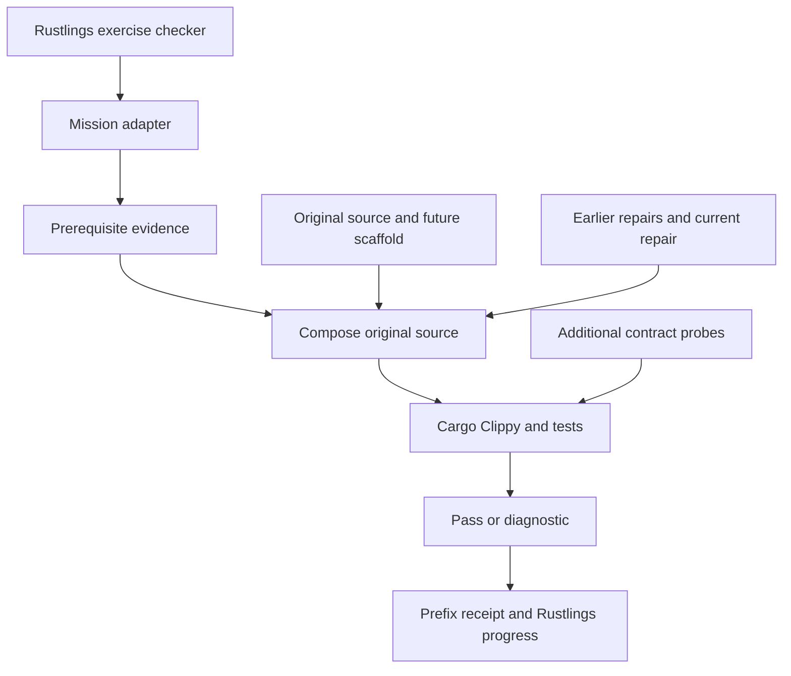

# Rebuild the Checker

Restore Rustlings by repairing Rustlings. This is a second course for learners who have already finished the normal Rustlings curriculum.

There are **112 cumulative missions** across ten chapters: **91 TODO implementations** and **21 injected regressions**. Every mission targets a real function in the pinned Rustlings implementation. The assessment compiles and tests that implementation with your repairs.

The reference is [`QuasarRay/rustlings@a650509c789d`](https://github.com/QuasarRay/rustlings/tree/a650509c789da1656f813392b16aa1fa043b7f3e), Rustlings 6.5.0. Finishing restores that version, including its existing behavior and limitations. This course does not silently upgrade its design.

## Start playing

Requirements: Rust 1.89 or newer, Cargo, Clippy, and rustfmt. The original engine needs Rust 1.88; the course verifier uses the standard library file-lock API introduced in Rust 1.89. The first preparation downloads the original Cargo.lock dependencies. After that, the verifier needs no network when those dependencies remain cached.

From a checkout of **this fork**:

```sh
cargo run --manifest-path dev/Cargo.toml --bin catalog_paths -- --prepare
cargo run -- --no-editor
```

The preparation compiles the original checker and runs its regression suite. It grants no mission completion. It is optional for correctness: this fork adds a course-specific command policy that allows cold builds. Native author threads queue behind one compiler permit, each outer command has a 600-second budget, and the verifier shares a 540-second budget across lock waiting, Clippy, and tests. Timeout cleanup terminates descendant processes. Ordinary courses and the pinned reference export retain the original engine policy.

For the normal installed-course experience, build this fork with `cargo build --release --locked`, then use that binary's absolute path in an empty directory:

```sh
/absolute/path/to/fork/target/release/rustlings init
cd rustlings
cargo run --bin catalog_paths -- --prepare
/absolute/path/to/fork/target/release/rustlings --no-editor
```

Use the binary built from this fork. Installing the upstream crate from crates.io gives the original beginner exercises.

## Mission rules

1. Open the current mission. Its header gives its prerequisite, target function, contract, and failure type.
2. Read the provided context and predict the failure. You are repairing application behavior, not relearning Rust syntax.
3. Edit the Rust between `BEGIN RUSTLINGS REPAIR` and `END RUSTLINGS REPAIR`. Keep the markers, adapter, and test intact.
4. Save. Rustlings builds the exercise, runs its test, runs Clippy, and executes it. The additive course command policy bounds compiler concurrency and accommodates cold builds. The exercise asks the course verifier to check the actual reconstructed Rustlings source.
5. Use `h` for a three-stage hint, `r` to retry, `l` for the mission map, and `n` after completion. `x` resets the current mission.
6. Earlier repairs are included in every later build. Editing or resetting an earlier mission invalidates its completion evidence; recheck from that mission onward.

A mission is cleared by compilation and regression evidence. There is no `completed = true` flag to edit. Like ordinary Rustlings, the course is an open learning environment, not a tamper-resistant exam: changing tests, the verifier, caches, or solution fixtures is outside the exercise contract.

The `repair!` token wrapper transports a function into its original module and `impl`. The wrapper itself does not expand in the small exercise binary. The verifier inserts its contents at the recorded source range and Cargo compiles it with the original project dependencies. Compiler diagnostics therefore point into `target/workshop/engine/`; repair the corresponding mission file, not that generated copy. The header and source map identify the original function. This arrangement preserves the existing checker and exercise dependency manifest.

## Campaign map

| Chapter | Missions | Responsibility | Badge |
| --- | --- | --- | --- |
| [Catalog](01_catalog/README.md) | 001–007 | Turn declarative course metadata into stable exercise identities, source paths, and Cargo targets. | The Cartographer |
| [Checker](02_checker/README.md) | 008–016 | Restore the exact compile, test, lint, and execution contract used to award completion. | The Gatekeeper |
| [Distribution](03_distribution/README.md) | 017–022 | Restore initialization, packaged assets, reset, and solution materialization. | The Quartermaster |
| [Progress](04_progress/README.md) | 023–039 | Restore persistence, idempotent status accounting, selection, aggregate checking, and completion. | The Archivist |
| [Terminal](05_terminal/README.md) | 040–048 | Restore bounded terminal output, progress, paths, and links. | The Signal Keeper |
| [Navigation](06_navigation/README.md) | 049–066 | Restore scrolling, filtering, search, selection mapping, and the list lifecycle. | The Navigator |
| [Watch](07_watch/README.md) | 067–084 | Restore debouncing, event ownership, input coordination, reruns, and watch/list transitions. | The Watchkeeper |
| [Editors](08_editors/README.md) | 085–096 | Restore process boundaries, editor selection, asynchronous startup, and Zellij pane management. | The Toolsmith |
| [Authoring](09_authoring/README.md) | 097–110 | Restore the original community-course creation and author-quality gates. | The Course Architect |
| [Launch](10_launch/README.md) | 111–112 | Restore embedding and launch dispatch, then assemble the unchanged upstream project from all repairs. | The Maintainer |

Badges are chapter names that help you remember the responsibilities. Rustlings' existing completion counter is the score. Reflection and transfer questions are practice prompts, not hidden automatic gates.

## What you build

A build combines the immutable pinned project, all earlier learner repairs, the current repair, and the still-supplied future implementation. Each mission replaces a disjoint source range. Later missions never overwrite earlier repairs. Solutions use earlier reference solutions so authors can validate them independently of learner progress.

This is incremental **restoration**, not a greenfield skeleton. Imports, type definitions, constants, small accessors, upstream tests, and functions not assigned as repair ranges remain supplied scaffold. The complete source still ships in the reference snapshot; every source range and scaffold boundary is inspectable in `01_catalog/missions.json`. All runtime subsystems are encountered. The course does not claim the learner types every line.

The grader runs the original project's Clippy gate and tests, plus additive contract probes for catalog defaults, paths, Cargo arguments, nonzero exits, compile/test/runtime rejection, persistence, selection, scroll boundaries, watch events, and author-name validation. It does not compare your code to a solution string to decide normal mission completion.

The reference solutions reconstruct every archived file byte for byte. Equivalent learner implementations may differ textually while satisfying the same tested contracts. This is not a proof of equivalence for every possible execution. The final reference export is exactly the pinned Rustlings implementation; the learner export contains the actual cumulative repairs, never a substituted reference answer.

## Final boss: run the restored checker

After clearing every mission, compile the small export driver and export your implementation to a new directory:

```sh
rustc --edition=2024 exercises/01_catalog/grader.rs -o target/workshop/grader-cli
target/workshop/grader-cli . export ../restored-rustlings
cargo test --locked --manifest-path ../restored-rustlings/Cargo.toml
cargo run --manifest-path ../restored-rustlings/Cargo.toml -- --help
```

On Windows the driver executable has the usual `.exe` suffix. Run the engine's author gate **from the exported root**, because Rustlings resolves several paths against its working directory:

```sh
cd ../restored-rustlings
cargo dev check --require-solutions
```

The export is the original checker project with your restored functions and its original beginner-course data. It deliberately contains no workshop grader, course execution policy, or extra probes. Its original exercises provide a useful independent subject on which to use the checker you restored. The host fork adds an opt-in-by-course command policy; existing engine logic and the reference archive remain intact.

For an author-only reference export, append `solutions` to the export command. That explicitly uses reference repairs and does not grant learner progress.

## Diagnose a stuck mission

| Observation | Meaning and next action |
| --- | --- |
| `LOCKED: complete or recheck ...` | An earlier source, verifier, or toolchain changed. Recheck the indicated mission and continue in order. |
| Error in `target/workshop/engine/src/...` | This is the real reconstructed code. Fix the mapped function in the mission file. |
| `todo!` or a missing binding | Implement the omitted operation; removing the marker without restoring behavior is insufficient. |
| Compilation succeeds but a test fails | Investigate state, boundaries, command arguments, and exit status. Read the named contract probe. |
| `INFRA_TIMEOUT` or `INFRA_ERROR` | The verifier could not judge the repair. Check tool availability, network access for uncached dependencies, and machine load, then retry. Infrastructure failures never become cached rejections. |
| Another course check owns the compiler lock | Wait for that check to finish and retry. The OS releases the lock automatically if its verifier exits; the lock file itself can remain. |
| A course file or reference input was deleted | Reinitialize a separate course directory with the same fork binary and restore the missing fixture. Preserve your edited missions. |
| An editor save changes several missions | Check them in order. Saved completion flags do not replace source-specific verification receipts. |

`target/workshop` contains disposable build artifacts, reports, and source-specific completion receipts. Removing it requires preparation and rechecking solved missions; it never removes learner source.

## Architecture description record

**Record:** AD-001, Rebuild the Checker. **Revision:** 1. **Status:** implemented course design. **Date:** 2026-09-23. **Owner:** fork maintainers. **Baseline:** the commit above. **Audience:** learners, course authors, maintainers, and reviewers.

This record uses the architecture-description concepts of [ISO/IEC/IEEE 42010:2022](https://www.iso.org/standard/74393.html): an entity of interest, stakeholders and concerns, viewpoints, views, model kinds, correspondences, and decision rationale. It is an ISO-aligned project record, not a claim of independently audited conformance to every clause of the paid standard.

### Entity, environment, and boundaries

The entity of interest is a Rustlings-hosted source-restoration curriculum. Its assessed product is the pinned Rustlings automatic checking infrastructure. Its environment is a local Rust toolchain, an ordinary filesystem, a terminal, and Cargo's dependency cache. Filesystem watching and editor integration retain the pinned implementation's OS behavior.

The unchanged host engine owns exercise order, UI, hints, build/test/lint/run gates, reset, solution reveal, and its progress file. Course-owned input fixtures provide a source archive, source-range registry, adapter, verifier, and extra regression probes. All generated code and evidence live under `target/workshop`. The separately exported final product contains the original project files with learner repairs.

### Stakeholders, perspectives, and concerns

| Stakeholder | Perspective | Concern IDs | Required outcome |
| --- | --- | --- | --- |
| Learner | Understand, implement, diagnose | C1 progression; C2 actionable feedback; C3 manageable tasks | Named missions, local contracts, hints, cumulative evidence, and clear source mapping. |
| Course author | Reuse the architecture for another subject | C4 author validation; C5 domain transfer | Independent failing-starter tests, passing solutions, and authoring-tool practice. |
| Maintainer | Preserve compatibility and fidelity | C6 engine preservation; C7 reproducibility; C8 cost | Unchanged existing engine source, pinned dependencies, inspectable mapping, incremental build caching. |
| Reviewer | Audit the resulting product | C9 traceability; C10 honest evidence | Source ranges, exact reference reconstruction, test reports, and explicit untested boundaries. |
| Upstream Rustlings contributors | Preserve provenance | C11 attribution and scope | Original license and implementation retained; no invented replacement runner. |

### Viewpoints and model kinds

| Viewpoint | Concerns framed | Model kind and interpretation | Evaluation method |
| --- | --- | --- | --- |
| VP1 curriculum | C1–C5 | Ordered mission table: an edge means an earlier repair is a prerequisite. | Sequential progression and locked-prerequisite tests. |
| VP2 source composition | C6, C7, C9, C11 | File/range mapping: each mission owns one disjoint byte interval at the pinned revision. | Bounds, overlap, complete archive, and byte-equality checks. |
| VP3 execution | C2, C4, C6, C8 | Process/dataflow view: a gate must return success before the next completion transition. | Original checks, added probes, and independent injected-defect audit. |
| VP4 state and recovery | C1, C7, C8, C10 | State transition table: certification is tied to a cumulative source prefix and verifier/toolchain identity. | Prior-edit invalidation, cache-input equality, interrupted-check recovery. |
| VP5 deployment and final artifact | C6, C7, C9–C11 | Artifact inventory: distinguish shipped course data, disposable checks, and the final original project. | Fresh initialization, export inventory, reference hashes, and standalone checks. |

### VP1 curriculum view

The campaign map and chapter mission tables instantiate VP1. The order moves from metadata to process execution, distribution, progress, terminal output, navigation, watch orchestration, editors, author tools, and final dispatch. Each chapter includes an architecture checkpoint and an unscored transfer problem. Source repair and troubleshooting alternate throughout the campaign; TODO missions require code writing and BUG missions require changing existing behavior.

### VP2 source composition view

| Artifact | Responsibility | Mutability |
| --- | --- | --- |
| `01_catalog/upstream.txt` | Length-prefixed UTF-8 snapshot of the pinned build-relevant original project, including its course data and license | Author fixture |
| `01_catalog/missions.tsv` | Ordered source-range map consumed without external runtime dependencies | Author fixture |
| `01_catalog/missions.json` | Human-inspectable contracts, source ranges, starter defects, and reference repairs | Author fixture |
| Chapter mission `.rs` files | Learner-owned repair plus unchanged adapter/test | Learner repair region |
| Matching solution `.rs` files | Exact original source for the same repair interval | Reference, revealed by Rustlings |
| `01_catalog/probes.txt` | Additive behavior tests inserted only into check builds | Author fixture |
| `01_catalog/runner.rs`, `grader.rs` | Course-only bridge from normal Rustlings exercise execution to source reconstruction | Author fixture |
| `target/workshop/engine` | Last assembled checking workspace, including probes | Disposable |
| Final export | Pinned original file inventory with cumulative repairs and no probes | Learner product |

The snapshot is the existing Rustlings project, not a newly designed target. It excludes unrelated website/workflow material from the final build artifact. Its `dev-Cargo.toml` symlink is materialized as the exact referenced manifest contents so the portable text archive works on Windows as well as Unix.

### VP3 execution view



The host's success contract remains build → optional tests → Clippy → execution. The course's execution performs another real Rustlings build and regression suite. There is one serialized compiler workspace per initialized course; cached reports avoid repeating equivalent checks. Cache hits require equality of the complete serialized source input, not just equality of a hash. Verifier, probe, registry, snapshot, and toolchain identity changes invalidate evidence.

The test snapshot preserves original production source except for learner replacements. Additional test modules are appended under `cfg(test)` and never appear in the export. Disposable check builds also add standalone workspace declarations to the two excluded exercise manifests, preventing an enclosing course workspace from capturing them. These boundary declarations are not exported. The original engine dependencies and Cargo.lock remain the compiler environment.

### VP4 state and recovery view

| State/event | Transition | Evidence |
| --- | --- | --- |
| First launch | Pending; prepare dependencies | Baseline compilation and tests; no learner receipt |
| Current repair fails | Remains pending | Compiler/Clippy/test diagnostics |
| Current repair passes | Record the entire certified prefix | Source-specific receipt plus host completion |
| Earlier repair changes | Later prefix evidence no longer matches | Recheck from the earliest changed mission |
| Solution is checked | Validate canonical prefix independently | Does not read or overwrite learner progress |
| Process interruption | Retain learner files; OS releases the compiler lock | Retry using the disposable check state |
| Final export | Require all learner receipts and revalidate composition | Actual learner source written to a new destination |

The persisted host done flags are a UI convenience. The verifier's prefix receipts bind earlier work to the implementation currently being checked. Neither mechanism is intended as adversarial exam security.

### VP5 deployment and final artifact view

Normal `rustlings init` embeds and materializes the renamed missions and their declared inputs through the unchanged upstream mechanism. A learner needs no source checkout after initialization. The root metadata and generated binary-registration list change to register the course; the CI workflow gains an author-audit preparation step. Existing engine source, dependencies, and checking behavior are retained.

The final export writes only to a previously nonexistent destination. It contains the original build-relevant inventory. Reference exports are byte-identical to the source archive; learner exports retain valid alternative implementations. The compiler workspace, receipts, added probes, course wrapper, and success messages are not part of the restored product.

### Correspondences and consistency rules

| Rule | Relationship | Verification |
| --- | --- | --- |
| CR1 | Every catalog name ↔ one starter ↔ one solution ↔ one bin pair | Rustlings dev check and metadata inventory |
| CR2 | Every repair ↔ one in-bounds, nonoverlapping source interval | Verifier registry validation |
| CR3 | Canonical repairs + scaffold ↔ pinned project contents | Audit compares every archived file byte for byte |
| CR4 | Mission N pass ↔ same certified repairs 1…N−1 | Cumulative prefix receipts |
| CR5 | Every starter defect ↔ independently failing reconstructed project | Audit inserts one starter into otherwise correct source |
| CR6 | Export ↔ actual cumulative learner repairs | Fresh composition and regression check; no reference substitution |
| CR7 | Claimed behavior ↔ named tests or stated manual limit | Validation record and limitations below |
| CR8 | Engine preservation ↔ unchanged baseline production files | Git scope review before publication |

### Decisions and rationale

| Decision | Rationale | Consequence |
| --- | --- | --- |
| D1: Restore pinned original source | The final product must remain Rustlings. | Existing design choices and limitations remain visible. |
| D2: Keep the existing host checker | Learners should experience and eventually understand the real workflow. | A course adapter is needed to compile multi-file fragments with original dependencies. |
| D3: Use disjoint cumulative repairs | Earlier work must contribute to later work. | Resetting an early repair can relock later missions. |
| D4: Preserve small supplied scaffolds | Requiring every import/accessor to be retyped adds effort without architectural learning. | Coverage distinguishes repaired functions from supplied wiring. |
| D5: Grade execution, not source-string equality | Different valid implementations should be testable. | Exact identity is established for the reference reconstruction; universal semantic equivalence is not claimed. |
| D6: Audit starters independently | Prerequisite failures can conceal a solved or ineffective later exercise. | CI runs an additional mutation audit before the normal author gate. |
| D7: Cache complete verified inputs | Rebuilding the whole checker on every unchanged rerun is wasteful. | Cache identity and recovery are explicit, inspectable course infrastructure. |
| D8: Keep reflection unscored | Architecture explanation requires judgment beyond compiler success. | Transfer prompts complement rather than replace automatic repair checks. |

### Evaluation limits and known baseline properties

The automated checks cover the original unit/integration tests and the added contract probes. They do not exhaust all terminal sizes, encodings, live editor versions, watcher backends, timing interleavings, or dependency behavior. Full-screen rendering, interactive key handling, and live Zellij/VS Code behavior still need manual smoke testing on the intended platform. The pinned pane-ID parser and internal indexing assumptions are preserved rather than silently hardened.

A single successful implementation can satisfy these tests without being equivalent in every untested case. The course does not claim formal verification. For an exact source-level reference, use the canonical solutions and the byte-identical reconstruction audit. For learner variants, inspect the changes and test the relevant additional cases.

The source archive, registry, and original dependency lockfile define this record's baseline. An upstream update requires remapping ranges, reviewing every contract and defect, rebuilding probes, rerunning the independent audit, and revising this record. Updating the engine snapshot without those steps is not supported.

## Maintainer validation

From a repository checkout:

```sh
bash exercises/01_catalog/audit.sh
cargo dev check --require-solutions
cargo test --locked --workspace
cargo fmt --all --check
```

The audit first checks the real baseline, then every isolated defect, and verifies exact reference reconstruction. It also warms the adapter binaries/tests/lints so the existing parallel checker does not time out on cold compilation. The CI addition runs this audit before the unchanged dev-check step. Audit results are written under `target/workshop/audit.txt`.

Do not run the author audit against a learner's edited starter set: its purpose is to prove the published starters remain unsolved. Use normal Rustlings checks for learner work.

## Validation record — 2026-09-23

Validated on Linux with Rust 1.98.1:

| Gate | Result |
| --- | --- |
| Isolated injected-defect audit | All 112 starters fail with every other repair correct. |
| Reference repair audit | All 112 canonical repairs pass; all 266 archived files reconstruct byte for byte. |
| Native author gate | `cargo dev check --require-solutions` passes for all 112 missions and solutions. |
| Original plus added engine regression tests | 22 unit tests and 8 integration tests pass. |
| Fresh release-mode initialization | All missions and declared inputs materialize without a source checkout. |
| Normal learner workflow | First starter fails; repaired first and second missions pass through Rustlings. |
| Prior-edit invalidation | Regressing the first repair relocks the second despite saved UI completion. |
| Cumulative learner export | All 112 learner prefixes pass; exported files match the pinned reference when using canonical repairs. |
| Exported standalone project | Its original workspace tests pass outside the workshop. |
| Completed initialized course | Native `rustlings check-all` passes after all repairs. |
| Scope | Existing engine source, production dependency manifests, lockfile, and build script are unchanged. |

Interactive full-screen behavior and external editor integrations retain the manual-validation limits described above. These results do not claim Windows/macOS execution coverage for the course verifier.

## Source map

Each entry below is a function restored by a mission. Everything outside the declared intervals is supplied original scaffold. `missions.json` records exact byte ranges and baseline line locations.

| Mission | Kind | Original source/function |
| --- | --- | --- |
| [001 catalog_paths](01_catalog/catalog_paths.rs) | TODO | `src/info_file.rs::path` |
| [002 catalog_defaults](01_catalog/catalog_defaults.rs) | BUG | `src/info_file.rs::default_true` |
| [003 catalog_loading](01_catalog/catalog_loading.rs) | TODO | `src/info_file.rs::parse` |
| [004 solution_paths](01_catalog/solution_paths.rs) | TODO | `src/exercise.rs::sol_path` |
| [005 manifest_boundaries](01_catalog/manifest_boundaries.rs) | BUG | `src/cargo_toml.rs::bins_start_end_ind` |
| [006 manifest_targets](01_catalog/manifest_targets.rs) | TODO | `src/cargo_toml.rs::append_bins` |
| [007 manifest_update](01_catalog/manifest_update.rs) | TODO | `src/cargo_toml.rs::updated_cargo_toml` |
| [008 cargo_metadata](02_checker/cargo_metadata.rs) | TODO | `src/cmd.rs::build` |
| [009 cargo_arguments](02_checker/cargo_arguments.rs) | BUG | `src/cmd.rs::cargo` |
| [010 process_status](02_checker/process_status.rs) | BUG | `src/cmd.rs::run_cmd` |
| [011 binary_location](02_checker/binary_location.rs) | TODO | `src/cmd.rs::run_debug_bin` |
| [012 command_tail](02_checker/command_tail.rs) | BUG | `src/cmd.rs::args` |
| [013 runtime_failure](02_checker/runtime_failure.rs) | BUG | `src/exercise.rs::run_bin` |
| [014 checker_pipeline](02_checker/checker_pipeline.rs) | TODO | `src/exercise.rs::run` |
| [015 exercise_entry](02_checker/exercise_entry.rs) | TODO | `src/exercise.rs::run_exercise` |
| [016 solution_entry](02_checker/solution_entry.rs) | BUG | `src/exercise.rs::run_solution` |
| [017 idempotent_directory](03_distribution/idempotent_directory.rs) | BUG | `src/embedded.rs::create_dir_if_not_exists` |
| [018 chapter_readme](03_distribution/chapter_readme.rs) | BUG | `src/embedded.rs::init_on_disk` |
| [019 materialize_exercises](03_distribution/materialize_exercises.rs) | TODO | `src/embedded.rs::init_exercises_dir` |
| [020 restore_exercise](03_distribution/restore_exercise.rs) | TODO | `src/embedded.rs::write_exercise_to_disk` |
| [021 reveal_solution](03_distribution/reveal_solution.rs) | TODO | `src/embedded.rs::write_solution_to_disk` |
| [022 initialize_workspace](03_distribution/initialize_workspace.rs) | TODO | `src/init.rs::init` |
| [023 load_progress](04_progress/load_progress.rs) | BUG | `src/app_state.rs::new` |
| [024 pending_count](04_progress/pending_count.rs) | BUG | `src/app_state.rs::n_pending` |
| [025 persist_progress](04_progress/persist_progress.rs) | TODO | `src/app_state.rs::write` |
| [026 select_index](04_progress/select_index.rs) | TODO | `src/app_state.rs::set_current_exercise_ind` |
| [027 select_name](04_progress/select_name.rs) | TODO | `src/app_state.rs::set_current_exercise_by_name` |
| [028 completion_count](04_progress/completion_count.rs) | BUG | `src/app_state.rs::set_status` |
| [029 reopen_exercise](04_progress/reopen_exercise.rs) | TODO | `src/app_state.rs::set_pending` |
| [030 reset_source](04_progress/reset_source.rs) | TODO | `src/app_state.rs::reset` |
| [031 reset_current](04_progress/reset_current.rs) | TODO | `src/app_state.rs::reset_current_exercise` |
| [032 reset_by_index](04_progress/reset_by_index.rs) | TODO | `src/app_state.rs::reset_exercise_by_ind` |
| [033 next_pending](04_progress/next_pending.rs) | BUG | `src/app_state.rs::next_pending_exercise_ind` |
| [034 solution_visibility](04_progress/solution_visibility.rs) | TODO | `src/app_state.rs::current_solution_path` |
| [035 parallel_check_all](04_progress/parallel_check_all.rs) | TODO | `src/app_state.rs::check_all_exercises_impl` |
| [036 save_check_all](04_progress/save_check_all.rs) | TODO | `src/app_state.rs::check_all_exercises` |
| [037 advance_progress](04_progress/advance_progress.rs) | TODO | `src/app_state.rs::done_current_exercise` |
| [038 finish_message](04_progress/finish_message.rs) | TODO | `src/app_state.rs::render_final_message` |
| [039 single_run_result](04_progress/single_run_result.rs) | TODO | `src/run.rs::run` |
| [040 terminal_budget](05_terminal/terminal_budget.rs) | TODO | `src/term.rs::new` |
| [041 ascii_width](05_terminal/ascii_width.rs) | TODO | `src/term.rs::write_ascii` |
| [042 unicode_width](05_terminal/unicode_width.rs) | TODO | `src/term.rs::write_str` |
| [043 progress_counter](05_terminal/progress_counter.rs) | TODO | `src/term.rs::increment` |
| [044 progress_bar](05_terminal/progress_bar.rs) | TODO | `src/term.rs::progress_bar` |
| [045 canonical_paths](05_terminal/canonical_paths.rs) | TODO | `src/term.rs::canonicalize` |
| [046 file_link_frame](05_terminal/file_link_frame.rs) | TODO | `src/term.rs::file_path` |
| [047 file_hyperlink](05_terminal/file_hyperlink.rs) | TODO | `src/term.rs::terminal_file_link` |
| [048 ansi_buffer](05_terminal/ansi_buffer.rs) | TODO | `src/term.rs::write_ansi` |
| [049 scroll_initial](06_navigation/scroll_initial.rs) | BUG | `src/list/scroll_state.rs::new` |
| [050 scroll_window](06_navigation/scroll_window.rs) | TODO | `src/list/scroll_state.rs::update_offset` |
| [051 scroll_next](06_navigation/scroll_next.rs) | TODO | `src/list/scroll_state.rs::select_next` |
| [052 scroll_previous](06_navigation/scroll_previous.rs) | BUG | `src/list/scroll_state.rs::select_previous` |
| [053 scroll_resize](06_navigation/scroll_resize.rs) | TODO | `src/list/scroll_state.rs::set_n_rows` |
| [054 scroll_padding](06_navigation/scroll_padding.rs) | BUG | `src/list/scroll_state.rs::update_scroll_padding` |
| [055 scroll_viewport](06_navigation/scroll_viewport.rs) | TODO | `src/list/scroll_state.rs::set_max_n_rows_to_display` |
| [056 list_model](06_navigation/list_model.rs) | TODO | `src/list/state.rs::build` |
| [057 list_resize](06_navigation/list_resize.rs) | TODO | `src/list/state.rs::set_term_size` |
| [058 list_rows](06_navigation/list_rows.rs) | TODO | `src/list/state.rs::draw_rows` |
| [059 list_render](06_navigation/list_render.rs) | TODO | `src/list/state.rs::draw` |
| [060 list_filter](06_navigation/list_filter.rs) | TODO | `src/list/state.rs::update_rows` |
| [061 list_index_mapping](06_navigation/list_index_mapping.rs) | TODO | `src/list/state.rs::selected_to_exercise_ind` |
| [062 list_reset](06_navigation/list_reset.rs) | TODO | `src/list/state.rs::reset_selected` |
| [063 list_search](06_navigation/list_search.rs) | TODO | `src/list/state.rs::apply_search_query` |
| [064 list_open](06_navigation/list_open.rs) | TODO | `src/list/state.rs::selected_to_current_exercise` |
| [065 list_keys](06_navigation/list_keys.rs) | TODO | `src/list.rs::handle_list` |
| [066 list_lifecycle](06_navigation/list_lifecycle.rs) | TODO | `src/list.rs::list` |
| [067 input_pause](07_watch/input_pause.rs) | BUG | `src/watch.rs::scoped_pause` |
| [068 debounce_updates](07_watch/debounce_updates.rs) | TODO | `src/watch/notify_event.rs::build` |
| [069 file_notifications](07_watch/file_notifications.rs) | BUG | `src/watch/notify_event.rs::handle_event` |
| [070 terminal_events](07_watch/terminal_events.rs) | TODO | `src/watch/terminal_event.rs::terminal_event_handler` |
| [071 watch_model](07_watch/watch_model.rs) | TODO | `src/watch/state.rs::build` |
| [072 watch_run](07_watch/watch_run.rs) | TODO | `src/watch/state.rs::run_current_exercise` |
| [073 watch_reset](07_watch/watch_reset.rs) | TODO | `src/watch/state.rs::reset_exercise` |
| [074 watch_change](07_watch/watch_change.rs) | TODO | `src/watch/state.rs::handle_file_change` |
| [075 watch_completion](07_watch/watch_completion.rs) | BUG | `src/watch/state.rs::done` |
| [076 watch_advance](07_watch/watch_advance.rs) | TODO | `src/watch/state.rs::next_exercise` |
| [077 watch_prompt](07_watch/watch_prompt.rs) | TODO | `src/watch/state.rs::show_prompt` |
| [078 watch_render](07_watch/watch_render.rs) | TODO | `src/watch/state.rs::render` |
| [079 watch_hint](07_watch/watch_hint.rs) | TODO | `src/watch/state.rs::show_hint` |
| [080 watch_check_all](07_watch/watch_check_all.rs) | TODO | `src/watch/state.rs::check_all_exercises` |
| [081 watch_resize](07_watch/watch_resize.rs) | TODO | `src/watch/state.rs::update_term_width` |
| [082 watch_dispatch](07_watch/watch_dispatch.rs) | TODO | `src/watch.rs::run_watch` |
| [083 watch_list_transition](07_watch/watch_list_transition.rs) | TODO | `src/watch.rs::watch_list_loop` |
| [084 watch_start](07_watch/watch_start.rs) | TODO | `src/watch.rs::watch` |
| [085 editor_process](08_editors/editor_process.rs) | TODO | `src/editor.rs::run_cmd` |
| [086 editor_discovery](08_editors/editor_discovery.rs) | TODO | `src/editor.rs::program_exists` |
| [087 editor_selection](08_editors/editor_selection.rs) | TODO | `src/editor.rs::new` |
| [088 editor_launch](08_editors/editor_launch.rs) | TODO | `src/editor.rs::open` |
| [089 editor_close](08_editors/editor_close.rs) | TODO | `src/editor.rs::close` |
| [090 editor_join](08_editors/editor_join.rs) | TODO | `src/editor.rs::join` |
| [091 pane_identifier](08_editors/pane_identifier.rs) | BUG | `src/editor/zellij.rs::parse_pane_id` |
| [092 pane_status](08_editors/pane_status.rs) | TODO | `src/editor/zellij.rs::pane_open` |
| [093 pane_close](08_editors/pane_close.rs) | TODO | `src/editor/zellij.rs::close_pane` |
| [094 app_editor_start](08_editors/app_editor_start.rs) | TODO | `src/app_state.rs::open_editor` |
| [095 app_editor_join](08_editors/app_editor_join.rs) | TODO | `src/app_state.rs::join_editor_handle` |
| [096 app_editor_close](08_editors/app_editor_close.rs) | TODO | `src/app_state.rs::close_editor` |
| [097 author_names](09_authoring/author_names.rs) | BUG | `src/dev/check.rs::forbidden_char` |
| [098 author_manifest](09_authoring/author_manifest.rs) | TODO | `src/dev/check.rs::check_cargo_toml` |
| [099 author_catalog](09_authoring/author_catalog.rs) | TODO | `src/dev/check.rs::check_info_file_exercises` |
| [100 author_file_inventory](09_authoring/author_file_inventory.rs) | TODO | `src/dev/check.rs::check_unexpected_files` |
| [101 author_unsolved](09_authoring/author_unsolved.rs) | TODO | `src/dev/check.rs::check_exercises_unsolved` |
| [102 author_format](09_authoring/author_format.rs) | TODO | `src/dev/check.rs::check_exercises` |
| [103 author_solutions](09_authoring/author_solutions.rs) | TODO | `src/dev/check.rs::check_solutions` |
| [104 author_gate](09_authoring/author_gate.rs) | TODO | `src/dev/check.rs::check` |
| [105 author_directories](09_authoring/author_directories.rs) | TODO | `src/dev/new.rs::create_rel_dir` |
| [106 author_files](09_authoring/author_files.rs) | TODO | `src/dev/new.rs::write_rel_file` |
| [107 author_new_course](09_authoring/author_new_course.rs) | TODO | `src/dev/new.rs::new` |
| [108 author_update_manifest](09_authoring/author_update_manifest.rs) | TODO | `src/dev/update.rs::update_cargo_toml` |
| [109 author_update](09_authoring/author_update.rs) | TODO | `src/dev/update.rs::update` |
| [110 author_dispatch](09_authoring/author_dispatch.rs) | TODO | `src/dev.rs::run` |
| [111 embedded_macro](10_launch/embedded_macro.rs) | TODO | `rustlings-macros/src/lib.rs::include_files` |
| [112 launch_dispatch](10_launch/launch_dispatch.rs) | TODO | `src/main.rs::main` |
